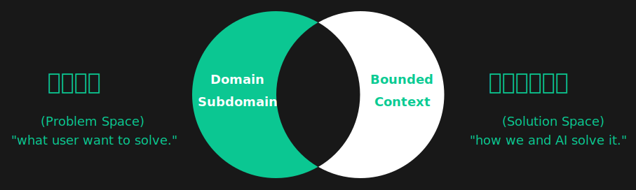

<p align="center">
  <a href="https://framework.unitmesh.cc/"></a>
</p>
<h1 align="center">Chocolate Factory</h1>

<p align="center">

<a href="https://github.com/unit-mesh/chocolate-factory/actions/workflows/build.yml"></a>
<a href="https://hub.docker.com/r/unitmesh"></a>
<a href="https://search.maven.org/artifact/cc.unitmesh/cocoa-core"></a>
</p>

[Read the docs →](https://framework.unitmesh.cc/)

## What is Chocolate Factory?

> Chocolate Factory 是一款开源的 AI Agent 应用引擎/应用框架，旨在帮助您轻松打造强大的 SDLC + LLM 生成助手。无论您是需要生成前端页面、后端
> API、SQL 图表，还是测试用例数据，Chocolate Factory 都能满足您的需求。

The key concepts of Chocolate Factory are:



(PS: Origin made by Michael Plöd
at [Aligning organization and architecture with strategic DDD](https://speakerdeck.com/mploed/aligning-organization-and-architecture-with-strategic-ddd))

A user's problem is processed by the following steps:

1. [ProblemClarifier.kt](cocoa-core/src/main/kotlin/cc/unitmesh/cf/core/flow/ProblemClarifier.kt)
2. [ProblemAnalyzer.kt](cocoa-core/src/main/kotlin/cc/unitmesh/cf/core/flow/ProblemAnalyzer.kt)
3. [SolutionDesigner.kt](cocoa-core/src/main/kotlin/cc/unitmesh/cf/core/flow/SolutionDesigner.kt)
4. [SolutionReviewer.kt](cocoa-core/src/main/kotlin/cc/unitmesh/cf/core/flow/SolutionReviewer.kt)
5. [SolutionExecutor.kt](cocoa-core/src/main/kotlin/cc/unitmesh/cf/core/flow/SolutionExecutor.kt)

## Development

See in [https://framework.unitmesh.cc/](https://framework.unitmesh.cc/) or see in [documents](./docs)

## Examples

- Online Demo: [https://framework.unitmesh.cc/](https://framework.unitmesh.cc/) (TODO)
- Video Demo: [https://www.bilibili.com/video/BV1T14y1C7p2](https://www.bilibili.com/video/BV1T14y1C7p2)
- Gif Demo: 

### Example 1: Frontend Screenshot

- 步骤 1：ProblemClarifier：使用响应式布局，编写一个聊天页面
    - 步骤 1.1：ProblemClarifier：左边是一个导航，中间是聊天区，聊天区的下方是一个输入按钮。
- 步骤 2：SolutionDesigner：请确认以下的设计是否符合您的要求。如果符合，请回复"YES"，如果不符合，请提出你的要求。
- 步骤 3：SolutionExecutor：生成一个聊天页面


### Example 2: 语义化代码搜索

- 步骤 1：ProblemAnalyzer 分析用户的需求，转为成多个语义化的查询
    - 中文、英文、HyDE 模式
- 步骤 2：SolutionExecutor：根据用户的需求，从数据库中检索出最相关的代码片段，由 ChatGPT 做总结

示例输入：Semantic Workflow 是如何实现的？

最终输出：


### Example 3: Testcase Generator

- 步骤 1：ProblemAnalyzer 分析用户的需求，确认是否是一个测试用例生成的需求
    - [x] 多 Temperature 模式：TemperatureMode.Default, TemperatureMode.Creative
- 步骤 2：SolutionDesigner 设计测试用例生成的方案
- 步骤 3：SolutionReviewer 确认方案是否符合用户的需求

示例输入：用户发表文章

最终输出：


### Examples 4: Code Interpreter

- 步骤 1：SolutionExecutor

#### 示例 1：编写乘法表

输出示例：

```markdown
1    2    3    4    5    6    7    8    9
2    4    6    8    10    12    14    16    18
3    6    9    12    15    18    21    24    27
4    8    12    16    20    24    28    32    36
5    10    15    20    25    30    35    40    45
6    12    18    24    30    36    42    48    54
7    14    21    28    35    42    49    56    63
8    16    24    32    40    48    56    64    72
9    18    27    36    45    54    63    72    81    
```

#### 示例 2：根据需求生成图表 （TODO）

生成一个 2023 年上半年电费图，信息如下：###1~6 月：201.2,222,234.3,120.2,90,90.4###

过程代码：

```kotlin-scripting
%use lets-plot

import kotlin.math.PI
import kotlin.random.Random


val incomeData = mapOf(
    "x" to listOf("一月", "二月", "三月", "四月", "五月", "六月"),
    "y" to listOf(201.2, 222, 234.3, 120.2, 90, 94.4)
)
letsPlot(incomeData) { x = "x"; y = "y" } +
        geomBar(stat = Stat.identity) +
        geomText(labelFormat = "\${.2f}") { label = "y"; } +
        ggtitle("2023 年上半年电费")
```

最终输出：


## License

RAG relevant modules were inspired by

- [LangChain4j](https://github.com/langchain4j/langchain4j)
- [LangChain](https://github.com/hwchase17/langchain)
- [LlamaIndex](https://github.com/jerryjliu/llama_index)
- [Spring AI](https://github.com/spring-projects-experimental/spring-ai)

Some RAG modules based on LangChain4j and Spring AI which is licensed under the Apache License 2.0.

This code is distributed under the MPL 2.0 license. See `LICENSE` in this directory.
