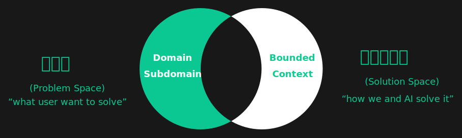

# Chocolate Factory

> Chocolate Factory 是一款开源的 LLM 应用引擎/LLM 应用框架，旨在帮助您打造 LLM 生成助手。

Online Demo: [https://framework.unitmesh.cc/](https://framework.unitmesh.cc/) (TODO)

## Key concepts

the core concepts of Chocolate Factory are:



(PS: Origin made by Michael Plöd
at [Aligning organization and architecture with strategic DDD](https://speakerdeck.com/mploed/aligning-organization-and-architecture-with-strategic-ddd))

a user query is processed by the following steps:

1. [ProblemClarifier.kt](src/main/kotlin/cc/unitmesh/cf/core/process/ProblemClarifier.kt)
2. [ProblemAnalyzer.kt](src/main/kotlin/cc/unitmesh/cf/core/process/ProblemAnalyzer.kt)
3. [SolutionDesigner.kt](src/main/kotlin/cc/unitmesh/cf/core/process/SolutionDesigner.kt)
4. [SolutionExecutor.kt](src/main/kotlin/cc/unitmesh/cf/core/process/SolutionExecutor.kt)

## Examples:

### Frontend Screenshot


- 步骤 1：ProblemClarifier：使用响应式布局，编写一个聊天页面
    - 步骤 1.1：ProblemClarifier：左边是一个导航，中间是聊天区，聊天区的下方是一个输入按钮。
- 步骤 2：SolutionDesigner：请确认以下的设计是否符合您的要求。如果符合，请回复"YES"，如果不符合，请提出你的要求。
- 步骤 3：SolutionExecutor：生成一个聊天页面

## Dev

Tech Stack:

- [Spring Boot](https://spring.io/projects/spring-boot) is a framework for building web applications.
- [Kotlin](https://kotlinlang.org/) is a modern programming language that makes developers happier.

To spike:

- [Kotlin Jupyter](https://github.com/Kotlin/kotlin-jupyter)  Kotlin kernel for Jupyter/IPython.
- [Kotlin Dataframe](https://github.com/Kotlin/dataframe) is typesafe in-memory structured data processing for JVM.
- [KInference](https://github.com/JetBrains-Research/kinference) is a library that makes it possible to execute complex
  ML models (written via ONNX) in Kotlin.

## Todos

- [ ] Workflow
    - Pre-defined workflow: Classify, Clarify, Analyze, Design, Execute
    - Custom workflow by JSON, Yaml, DSL
    - Auto workflow
- [ ] API calling
    - Auto generate API calling code
- [ ] extend code Trigger
    - like ArchGuard code diff for test suggestion

## Usecases

使用场景，基于知识库的：

- 一句话生成前端页面 (特定框架与场景)
    1. Problem Analyser: 确认需求
        - [ ] 匹配现有需求
    2. Problem Clarifier: 确认输入和输出
        - [ ] 输出 ASCII DSL 作为输入 （ [Design](https://github.com/phodal/design) ）
        - [ ] 将历史页面转换为 ASCII DSL
    3. Solution Design: 设计布局
        - [ ] 搜索历史组件布局
    4. Solution Execute: 生成页面 (React, React Runtime)
        - [ ] Code Interpreter by [Unit Runtime](https://github.com/unit-mesh/unit-runtime)
- 一句话生成后端 API (Ktor, Spring, Kotless）
    1. 确认需求
    2. 输入和输出
    3. 确认数据库表
        - [ ] 搜索历史数据库表
    4. 确认生成的 API
- 一句话生成 SQL 图表
    1. 识别问题领域
    2. 确认与澄清问题
    3. 分析问题与数据
    4. 生成 SQL 与图表 (Kotlin Jupyter, [Lets-Plot](https://github.com/JetBrains/lets-plot-kotlin))
- 一句话生成测试用例数据
    1. 识别需求（bug、代码变更、用例）
    2. 匹配搜索相关的代码
    3. 生成初步测试用例
    4. 生成结果（测试数据集）

### Setup

### Export keys in Local

```bash
export OPENAI_API_KEY=
export OPENAI_HOST=
```

## License

This code is distributed under the MPL 2.0 license. See `LICENSE` in this directory.
