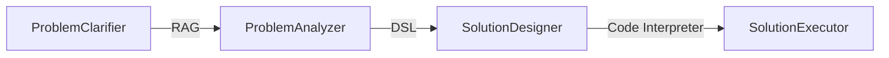

<p align="center">
  <a href="https://framework.unitmesh.cc/"></a>
</p>
<h1 align="center">Chocolate Factory</h1>

<p align="center">

<a href="https://github.com/unit-mesh/chocolate-factory/actions/workflows/build.yml"></a>
<a href="https://hub.docker.com/r/unitmesh"></a>
<a href="https://central.sonatype.com/namespace/cc.unitmesh"></a>
</p>

# What is Chocolate Factory?

> Chocolate Factory 是一款开源的 AI Agent 应用引擎/应用框架，旨在帮助您轻松打造强大的 SDLC + LLM 生成助手。无论您是需要生成前端页面、后端
> API、SQL 图表，还是测试用例数据，Chocolate Factory 都能满足您的需求。

## Quick Start

方式 1：本地部署

```bash
git clone https://github.com/unit-mesh/chocolate-factory
# modify OPENAI_API_KEY and OPENAI_HOST in docker-compose.yml
docker-compose up
```

方式 2：使用 RAGScript

```kotlin
@file:DependsOn("cc.unitmesh:rag-script:0.3.3")

import cc.unitmesh.rag.*

rag {
    indexing {
        val chunks = text("fun main(args: Array<String>) {\n    println(\"Hello, World!\")\n}").split()
        store.indexing(chunks)
    }

    querying {
        store.findRelevant("Hello World")
    }
}
```

方式 3：集成到 JVM 项目中

模块列表：[https://central.sonatype.com/namespace/cc.unitmesh](https://central.sonatype.com/namespace/cc.unitmesh)

latest version: <a href="https://central.sonatype.com/namespace/cc.unitmesh"></a>

```groovy
dependencies {
    // 核心模块
    implementation 'cc.unitmesh:cocoa-core:0.3.3'
    // Pinecone
    implementation 'cc.unitmesh:store-pinecone:0.3.3'
    // ElasticSearch
    implementation 'cc.unitmesh:store-elasticsearch:0.3.3'
    //...其它模块
}
```

更多示例见：[examples/](https://github.com/unit-mesh/chocolate-factory-examples)

## 设计理念：领域驱动的问题求解

Chocolate Factory 是基于领域驱动设计思想的，如下图所示：


> 软件系统的构建实则是对问题空间的求解，以此获得构建解空间的设计方案。 —— 《解构领域驱动设计》

在领域驱动设计（Domain-Driven Design，简称DDD）中，问题空间（Problem Space）和解空间（Solution
Space）是两个关键的概念，用于帮助开发团队理解和建模复杂的领域问题以及设计相应的软件解决方案：（由 ChatGPT 生成）

- 问题空间（Problem Space） 问题空间是指领域中实际的业务问题、需求和挑战，它关注的是业务领域的本质问题和业务需求。在问题空间中，团队与领域专家合作，收集和理解领域的业务规则、流程、概念以及业务需求。
- 解空间（Solution Space）是指基于问题空间的理解所提出的软件解决方案，包括软件架构、设计模式、编码实现等。在解空间中，开发团队将问题空间的概念和需求映射到具体的代码和技术实现上。

DDD 强调问题空间和解空间之间的分离，这意味着在开始开发之前，团队应该首先深入了解问题空间，与领域专家合作，确保对领域的理解是准确的。然后，他们可以将这个理解映射到解空间，设计和实现相应的软件系统。

### Stage 设计



根据上面的思想，我们设计了五个 Stage：

- ProblemClarifier.kt：根据用户提供的文本来澄清问题，以确保准确理解用户的需求。问题澄清器的任务是分析用户的输入，提取关键信息，可能要求用户提供更多详细信息以确保问题清晰，并将清晰的问题描述传递给下一步。
- ProblemAnalyzer.kt：可以进一步分析问题，将问题细化成更具体的子问题或任务，以帮助解决方案的设计和执行。
- SolutionDesigner.kt：根据经过问题澄清和分析后的用户需求，设计一个解决方案。解决方案设计师的任务是将问题领域的需求转化为可执行的计划或设计，确保解决方案符合用户的期望和要求。
- SolutionReviewer.kt：负责审核已经设计好的解决方案，以确保其质量、安全性和合规性。审核员可能会对解决方案进行测试和评估，并提出建议或修改，以满足特定标准和要求。
- SolutionExecutor.kt：负责实际执行解决方案的步骤，根据设计好的计划来生成结果。根据具体情况，解决方案执行者的任务可以包括编程、自动化、生成文档等。

在不同的领域里，会根据场景不同，而有所取舍。

### 示例：文本生成前端代码

- 步骤 1：ProblemClarifier：使用响应式布局，编写一个聊天页面
    - 步骤 1.1：ProblemClarifier：左边是一个导航，中间是聊天区，聊天区的下方是一个输入按钮。
- 步骤 2：SolutionDesigner：请确认以下的设计是否符合您的要求。如果符合，请回复"YES"，如果不符合，请提出你的要求。
- 步骤 3：SolutionExecutor：生成一个聊天页面

示例：


