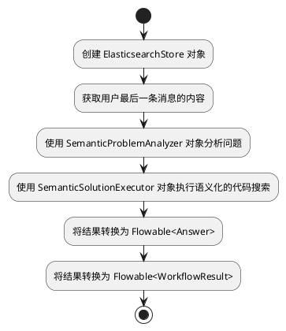

## 相近上下文

查询条件：

question: Semantic Workflow 是如何实现的？

- englishQuery: How is Semantic Workflow implemented?
- originLanguageQuery: Semantic Workflow 是如何实现的？
- hypotheticalCode:
```kotlin
public class SemanticWorkflow {
   private WorkflowEngine engine;
   
   public SemanticWorkflow() {
      engine = new WorkflowEngine();
   }
   
   public void executeWorkflow(Workflow workflow) {
      // Perform semantic analysis on the workflow
      SemanticAnalyzer analyzer = new SemanticAnalyzer();
      Workflow analyzedWorkflow = analyzer.analyze(workflow);
      
      // Execute the analyzed workflow using the workflow engine
      engine.execute(analyzedWorkflow);
   }
}
```

代码片段：

```bash
0.7847863 // canonicalName: cc.unitmesh.cf.domains.semantic.CodeSemanticWorkflowTest
0.76635444 // canonicalName: cc.unitmesh.cf.domains.semantic.CodeSemanticDecl
0.74648994 // canonicalName: cc.unitmesh.cf.core.flow.ProblemAnalyzer
0.7410852 // canonicalName: cc.unitmesh.cf.domains.spec.SpecDomainDecl
0.72767156 // canonicalName: cc.unitmesh.cf.core.flow.DomainDeclaration
0.73245597 // canonicalName: cc.unitmesh.cf.core.flow.model.WorkflowResult
0.7434818 // canonicalName: cc.unitmesh.cf.domains.interpreter.CodeInterpreterWorkflow.execute
0.757218 // canonicalName: cc.unitmesh.cf.core.flow.Workflow
0.7722022 // canonicalName: cc.unitmesh.cf.domains.semantic.flow.SemanticProblemAnalyzer
0.807935 // canonicalName: cc.unitmesh.cf.domains.semantic.CodeSemanticWorkflow.execute
```

## 输出

根据提供的代码，我们可以看到 CodeSemanticWorkflow 是一个继承自 Workflow 的类，它实现了 execute 方法来执行语义化的代码搜索。

在 execute 方法中，它首先创建了一个 ElasticsearchStore 对象，并获取了用户最后一条消息的内容作为问题。然后，它使用 SemanticProblemAnalyzer
对象来分析问题，该对象使用 llmProvider 来完成问题的解析。接下来，它使用 SemanticSolutionExecutor 对象来执行语义化的代码搜索，并将结果转换为
Flowable<Answer>。最后，它调用 toFlowableResult 方法将结果转换为 Flowable<WorkflowResult> 并返回。

下面是一个使用 PlantUML 绘制的流程图，展示了 CodeSemanticWorkflow 的执行过程：



希望以上信息能够回答您的问题。
