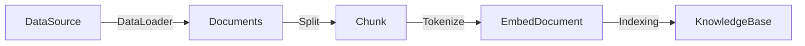
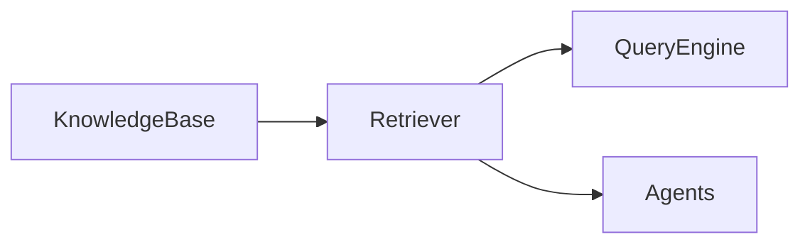

# RAG

检索增强（Retrieval Augmented Generation）生成将从源数据（DataSource）中提取信息并将其分成（Splitter）较小的单元，每个单元都在模型的
令牌限制内（Tiktoken）。然后， 这些片段（Chunk）被存储 在数据库（VectorStore）中。 当用户发出请求时， 从数据库中检索（Retriever）出
最相关（Relevant） 的文档片段（Document）， 以丰富提示词（prompt），以提高 AI 模型的响应准确性。

关键概念：

- 数据加载器（Data Loaders ）负责读取和格式化数据，以便将其分成适合存储在数据库中的片段。
- 分割器（Splitters）：Splitters 是用来将源数据分割成较小单元（Chunks）的工具或组件，
- 数据库（Vector Database）负责通过高效的向量检索技术来实现文档片段的快速检索。
- 检索器（Retrievers）负责从数据库中检索出最相关的文档片段。

## Indexing 阶段

> 准备知识库，提炼知识，以便在查询阶段进行检索。

流程示例：



## Querying 阶段

> 从知识库中检索出相关的上下文，以协助 LLM 回答问题。

流程示例：



## RAGScript 示例

详细见注释：

```kotlin
rag {
    indexing {
        // 从文件中读取文档
        val document = document("filename.txt")
        // 将文档切割成 chunk
        val chunks = document.split()
        // 建立索引
        store.indexing(chunks)
    }

    querying {
        // 查询
        store.findRelevant("workflow dsl design ").also {
            println(it)
        }
    }
}
```